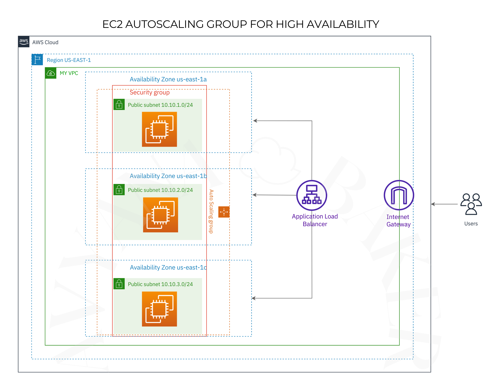
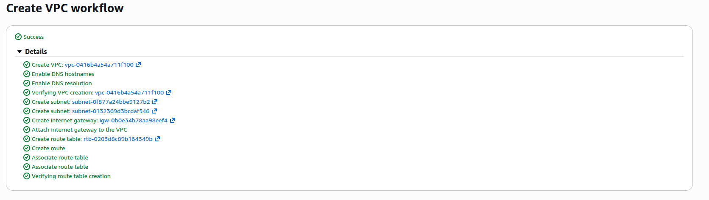
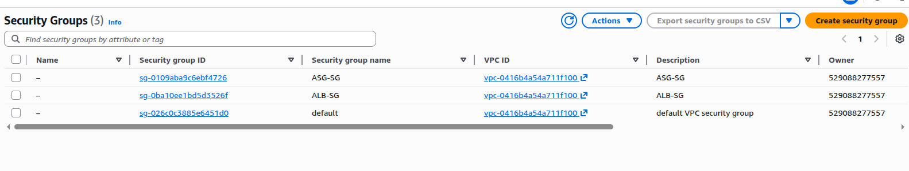
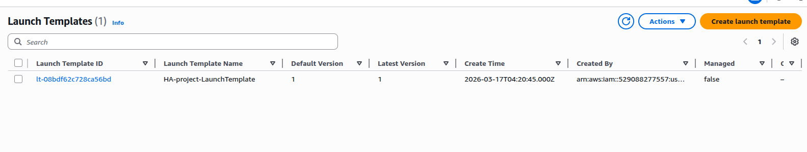
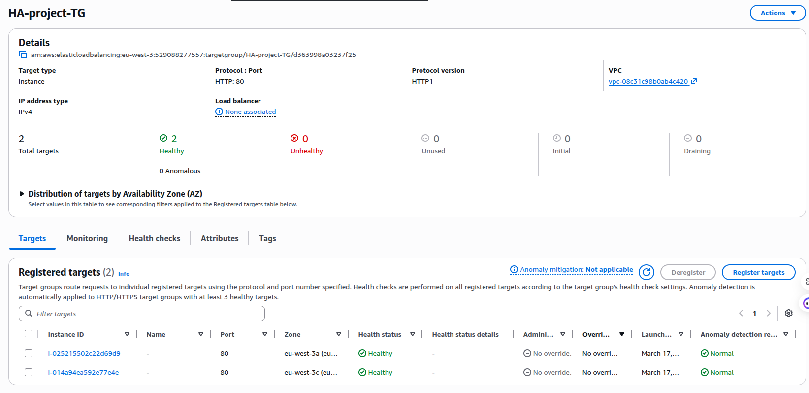
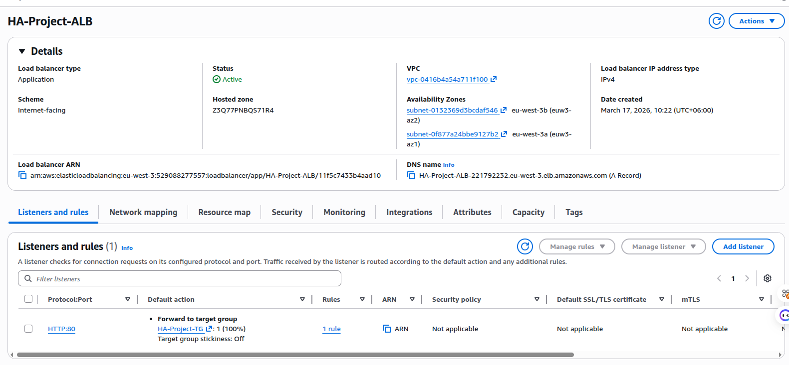

# Highly Available Architecture on AWS (ALB + ASG, 3 AZ)

This project demonstrates a highly available web architecture on AWS using an **Application Load Balancer (ALB)** and an **Auto Scaling Group (ASG)** spread across **three Availability Zones**. It supports **automatic failover** and **automatic scale-out/scale-in** based on traffic.

## What This Includes

- VPC with public subnets in 3 AZs
- Application Load Balancer (ALB)
- Target Group with health checks
- Auto Scaling Group (ASG) using a Launch Template
- Security Groups for ALB and EC2 instances
- User data script to install Apache and serve a simple page

## Architecture

The system distributes traffic across instances in multiple AZs. If one AZ or instance fails, traffic is routed to healthy instances in other AZs. When traffic increases, the ASG launches new instances automatically; when traffic drops, it scales in.



## Steps

### 1. Create VPC and Subnets (3 AZ)


### 2. Security Groups


Security group rules used in this setup:
- **ALB SG**: Inbound allow all traffic (e.g., `0.0.0.0/0` on HTTP/HTTPS).
- **ASG/EC2 SG**: Inbound allow only from **ALB SG**.

### 3. Launch Template


### 4. Target Group


### 5. Application Load Balancer (ALB)


### 6. Instances Behind ALB (Sample Responses)


## User Data Script

The ASG uses this user data to install Apache and display a simple page:

```bash
#!/bin/bash
apt update -y
apt install -y apache2
systemctl start apache2
systemctl enable apache2
echo "<h1>ALB + Auto Scaling Web Server</h1><h2>Hostname: $(hostname)</h2>" > /var/www/html/index.html
```

Source: `UserData/ubuntu-apache.sh`

## How It Works

- **ALB** routes HTTP traffic to healthy targets in the **Target Group**.
- **ASG** maintains desired capacity across 3 AZs and replaces unhealthy instances.
- **Health checks** ensure only healthy instances receive traffic.
- **Scaling policies** allow automatic scale-out and scale-in.

## Testing Ideas

- Stop one instance and confirm traffic continues to other instances.
- Increase load (e.g., using a load test) and confirm ASG scales out.
- Reduce load and confirm ASG scales in.

## Notes

- This repo focuses on the architecture steps and screenshots.
- You can customize instance types, scaling policies, and health check settings based on your needs.
